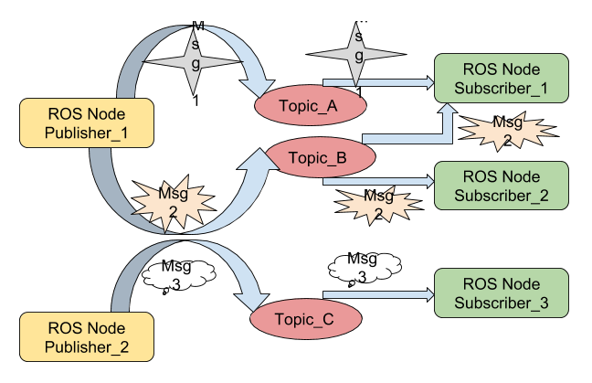

## Overview

This chapter covers the fundamentals of the Robot Operating System 2 (ROS 2), a key framework for robotics development.

## Objectives

- Understand the core concepts of ROS 2 (nodes, topics, services, actions).
- Learn how to create a simple ROS 2 package.
- Understand the ROS 2 command-line interface.

## Core Content

ROS 2 is an open-source framework for building robotic applications. It provides a set of tools, libraries, and conventions to simplify the task of creating complex and robust robot behavior across a wide variety of robotic platforms.

### Key Concepts

- **Nodes**: A node is a process that performs computation. In ROS 2, a single executable can contain one or more nodes.
- **Topics**: Topics are named buses over which nodes exchange messages. Topics have anonymous publish/subscribe semantics.
- **Services**: Services are a request/response type of communication. One node offers a service, and another node can call that service.
- **Actions**: Actions are for long-running tasks. They provide feedback during execution and can be preempted.

## Examples

### A Simple Publisher Node (Python)

```python
import rclpy
from rclpy.node import Node
from std_msgs.msg import String

class SimplePublisher(Node):
    def __init__(self):
        super().__init__('simple_publisher')
        self.publisher_ = self.create_publisher(String, 'chatter', 10)
        self.timer = self.create_timer(0.5, self.timer_callback)
        self.i = 0

    def timer_callback(self):
        msg = String()
        msg.data = f'Hello World: {self.i}'
        self.publisher_.publish(msg)
        self.get_logger().info(f'Publishing: "{msg.data}"')
        self.i += 1

def main(args=None):
    rclpy.init(args=args)
    simple_publisher = SimplePublisher()
    rclpy.spin(simple_publisher)
    simple_publisher.destroy_node()
    rclpy.shutdown()

if __name__ == '__main__':
    main()
```

### Running the Publisher

To run this node, you would save it as a Python file, and then run it with `python your_node.py`. You could then listen to the `chatter` topic using the ROS 2 CLI:

```bash
ros2 topic echo /chatter
```

## Figures



*Figure 1: A simple ROS 2 system with a publisher node, a subscriber node, and a topic connecting them.*

## Summary

This chapter provided a brief introduction to the fundamental concepts of ROS 2, including nodes, topics, services, and actions. We also saw a simple example of a publisher node written in Python. In the next chapters, we will build upon these concepts to create more complex robotic applications.