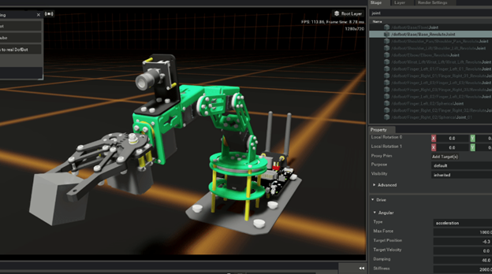

## Overview

This chapter focuses on NVIDIA Isaac Sim, a powerful platform for robotics simulation and AI training.

## Objectives

- Understand the capabilities of NVIDIA Isaac Sim.
- Learn how to integrate ROS 2 with Isaac Sim.
- Explore Isaac Sim's features for AI training.

## Core Content

NVIDIA Isaac Sim is a scalable robotics simulation application and synthetic data generation tool that powers AI-based robots. It is built on NVIDIA Omniverse and provides a photorealistic, physically accurate virtual environment for developing, testing, and training AI-based robots.

### ROS 2 Integration

Isaac Sim has built-in support for ROS 2, which allows for seamless integration with your existing ROS 2 applications. You can use the ROS 2 bridge to publish data from Isaac Sim to ROS 2 topics, and subscribe to ROS 2 topics to control objects in the simulation.

## Examples

### Connecting Isaac Sim to ROS 2

Here is an example of a simple Python script that creates a cube in Isaac Sim and publishes its position to a ROS 2 topic.

```python
import carb
from omni.isaac.kit import SimulationApp

CONFIG = {"renderer": "RayTracedLighting", "headless": False}
simulation_app = SimulationApp(CONFIG)

from omni.isaac.core import World
from omni.isaac.core.objects import cuboid
import omni.isaac.ros2_bridge as ros2_bridge

world = World()
world.scene.add_default_ground_plane()

# Create a cube
cube = world.scene.add(
    cuboid.VisualCuboid(
        prim_path="/World/random_cube",
        name="my_cube",
        position=[0, 0, 1.0],
        scale=[0.5, 0.5, 0.5],
        color=[1.0, 0, 0],
    )
)

# Start ROS 2 bridge
ros2_bridge.activate_ros_bridge()

# ... (code to publish cube position to a ROS 2 topic)

# Run simulation
while simulation_app.is_running():
    world.step(render=True)

simulation_app.close()
```

## Figures



*Figure 1: A complex robot model in the photorealistic Isaac Sim environment.*

## Summary

This chapter provided an overview of NVIDIA Isaac Sim and its capabilities for robotics simulation and AI training. We also saw an example of how to integrate Isaac Sim with ROS 2. In the next chapter, we will explore Vision-Language-Action models.