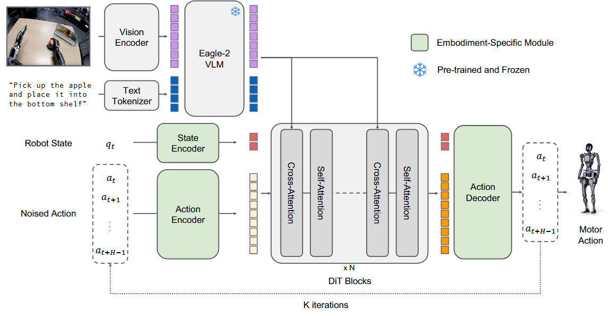

## Overview

This chapter delves into Vision-Language-Action (VLA) models, a cutting-edge area of AI that enables robots to understand and interact with the world in a more human-like way.

## Objectives

- Understand the architecture of VLA models.
- Explore how VLAs are used in robotics.
- Learn about the challenges and future of VLAs.

## Core Content

Vision-Language-Action (VLA) models are a type of AI model that can process and understand information from multiple modalities, including vision (images, video), language (text), and action (robot control signals). This allows them to perform tasks that require a deep understanding of the world, such as following natural language instructions to manipulate objects.

### Architecture

VLA models typically consist of three main components:

- **Vision Encoder**: Processes visual input and extracts relevant features.
- **Language Encoder**: Processes textual input and extracts relevant features.
- **Action Decoder**: Takes the fused vision and language features as input and generates a sequence of actions.

## Examples

### A conceptual VLA model

While a full implementation of a VLA model is beyond the scope of this book, here is a conceptual example of how you might use a pre-trained VLA model to control a robot.

```python
import numpy as np
from vla_model import VLAModel

# Load a pre-trained VLA model
vla = VLAModel.from_pretrained("google/rt-1-x")

# Get an image from the robot's camera
image = get_camera_image()

# Get a natural language instruction
instruction = "pick up the red block"

# Use the VLA model to generate a sequence of actions
actions = vla.predict(image, instruction)

# Execute the actions on the robot
for action in actions:
    robot.execute(action)
```

## Figures



*Figure 1: A high-level diagram of a Vision-Language-Action (VLA) model, showing the vision and language encoders and the action decoder.*

## Summary

This chapter introduced Vision-Language-Action (VLA) models and their architecture. We saw a conceptual example of how a VLA model can be used to control a robot based on natural language instructions. In the final chapter, we will discuss the challenges and practical considerations of deploying AI models on humanoid robots.