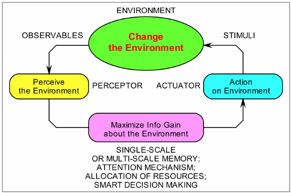

## جائزہ

اس باب میں فزیکل AI کے بنیادی تصورات کا تعارف کرایا گیا ہے، جو ڈیجیٹل AI اور طبعی دنیا کے درمیان فرق کو ختم کرتا ہے۔

## مقاصد

- فزیکل اے آئی کی تعریف اور دائرہ کار کو سمجھیں۔
- جسمانی AI اور روایتی AI کے درمیان فرق کریں۔
- جسمانی AI میں چیلنجوں اور مواقع کی تعریف کریں۔

## بنیادی مواد

فزیکل اے آئی، جسے ایمبوڈیڈ اے آئی بھی کہا جاتا ہے، مصنوعی ذہانت کا ایک شعبہ ہے جو ذہین ایجنٹوں کی تخلیق پر توجہ مرکوز کرتا ہے جو جسم کے ذریعے جسمانی دنیا کے ساتھ تعامل کر سکتے ہیں۔ روایتی AI کے برعکس، جو اکثر خالصتاً ڈیجیٹل شکل میں موجود ہوتا ہے (مثال کے طور پر، شطرنج کے پروگرام، زبان کے ماڈل)، فزیکل AI سسٹمز اپنے ماحول کو سمجھنے، اس کی وجہ جاننے اور اس پر اثر انداز ہونے والے اعمال انجام دینے کی صلاحیت رکھتے ہیں۔ حقیقی دنیا کے ساتھ یہ تعامل بہت سارے چیلنجوں کا تعارف کرواتا ہے جو خالصتاً ڈیجیٹل ڈومینز میں موجود نہیں ہیں، جیسے کہ سینسر کا شور، ایکچیویٹر کی درستگی، اور انسانوں کے ارد گرد محفوظ طریقے سے کام کرنے کی ضرورت۔

### کلیدی تصورات

- **مجسمہ**: یہ بنیادی خیال ہے کہ ایک ذہین ایجنٹ کا جسم صرف ایک غیر فعال کنٹینر نہیں ہے بلکہ اس کے علمی عمل میں ایک اہم کردار ادا کرتا ہے۔ روبوٹ کی شکل، سینسرز اور ایکچیوٹرز اس بات پر اثر انداز ہوتے ہیں کہ وہ دنیا کو کیسے سمجھتا ہے اور وہ کیا سیکھ سکتا ہے۔ مثال کے طور پر، پہیوں والا روبوٹ ٹانگوں والے روبوٹ کے مقابلے میں مختلف طریقے سے نیویگیٹ کرنا سیکھے گا۔
- **پرسیپشن**: یہ ایجنٹ کی صلاحیت ہے کہ وہ اپنے ماحول کے بارے میں سینسرز جیسے کیمروں، LiDAR، ٹیکٹائل سینسرز، اور مائیکروفونز کے ذریعے معلومات اکٹھی کر سکے۔ خام سینسر ڈیٹا کو دنیا کی بامعنی نمائندگی کے لیے پروسیس کیا جانا چاہیے جسے ایجنٹ فیصلہ سازی کے لیے استعمال کر سکتا ہے۔
- **ایکشن**: یہ ایک ایجنٹ کی موٹرز، گرپرز اور پہیوں جیسے ایکچیوٹرز کے ذریعے اپنے ماحول کو متاثر کرنے کی صلاحیت ہے۔ اعمال کا دائرہ سادہ حرکتوں جیسے جوائنٹ کو گھمانے سے لے کر پیچیدہ طرز عمل جیسے کسی چیز کو پکڑنا یا چلنا ہو سکتا ہے۔
- **استدلال**: یہ ایک ایجنٹ کی اپنے ادراک اور اہداف کی بنیاد پر فیصلے کرنے اور مسائل حل کرنے کی صلاحیت ہے۔ اس میں کسی مقصد کو حاصل کرنے کے لیے اعمال کی ترتیب کی منصوبہ بندی کرنا، کارکردگی کو بہتر بنانے کے لیے تجربے سے سیکھنا، یا اس کے اعمال کے نتائج کے بارے میں استدلال شامل ہو سکتا ہے۔

## مثالیں۔

- ایک انسان نما روبوٹ جو ناہموار خطوں پر چلنا سیکھ رہا ہے۔
- ٹریفک قوانین کی پابندی کرتے ہوئے شہر کی ایک مصروف سڑک پر خود سے چلنے والی کار۔
- ایک فیکٹری میں ایک روبوٹک بازو جو حصوں کے سیٹ سے پروڈکٹ کو جمع کرنا سیکھ رہا ہے۔

## اعداد و شمار

*شکل 1: پرسیپشن-ایکشن لوپ، یہ بتاتا ہے کہ کس طرح ایک ایجنٹ دنیا کی حالت کو سمجھتا ہے، اس کی وجوہات، اور ایک ایسا اقدام کرتا ہے، جس کے نتیجے میں دنیا کی حالت بدل جاتی ہے۔*

## خلاصہ

اس باب نے فزیکل اے آئی کے بنیادی تصورات کو متعارف کرایا، جس میں مجسمیت کی اہمیت اور ادراک، استدلال اور عمل کے مسلسل چکر کو اجاگر کیا گیا۔ ہم نے جسمانی AI کو روایتی AI سے ممتاز کیا اور روبوٹکس اور خود مختار نظاموں میں اس کے اطلاق کی کچھ مثالیں دریافت کیں۔ ذہین جسمانی ایجنٹوں کی تعمیر کے لیے استعمال کی جانے والی مخصوص ٹیکنالوجیز اور تکنیکوں کو دریافت کرنے کے لیے درج ذیل ابواب ان بنیادی خیالات پر استوار ہوں گے۔