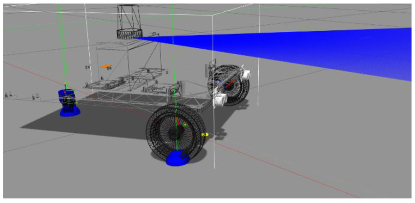

## جائزہ

یہ باب ڈیجیٹل جڑواں بچوں اور نقلی ماحول کے تصورات کو دریافت کرتا ہے، جو روبوٹک نظاموں کو تیار کرنے اور جانچنے کے لیے اہم ہیں۔

## مقاصد

- ڈیجیٹل جڑواں کے تصور کو سمجھیں۔
- مقبول نقلی ماحول جیسے Gazebo اور Unity کے بارے میں جانیں۔
- ایک بنیادی نقلی ترتیب دینے کا طریقہ سمجھیں۔

## بنیادی مواد

ایک ڈیجیٹل جڑواں ایک جسمانی چیز یا نظام کی ایک مجازی نمائندگی ہے. روبوٹکس میں، ایک ڈیجیٹل جڑواں ایک روبوٹ اور اس کے ماحول کا ایک تفصیلی تخروپن ہے، جسے جسمانی روبوٹ میں تعینات کرنے سے پہلے ترقی، جانچ اور توثیق کے لیے استعمال کیا جا سکتا ہے۔ ان ڈیجیٹل جڑواں بچوں کو بنانے کے لیے عام طور پر Gazebo اور Unity جیسے نقلی ماحول استعمال کیے جاتے ہیں۔

### Gazebo کے ساتھ ایک بنیادی نقلی ترتیب دینا

Gazebo ایک مقبول اوپن سورس روبوٹکس سمیلیٹر ہے۔ ایک بنیادی نقلی ترتیب دینے کے لیے، آپ عام طور پر اپنے روبوٹ اور اس کے ماحول کو SDF (Simulation Description Format) یا URDF (Unified Robot Description Format) فائلوں میں بیان کریں گے۔

## مثالیں۔

### SDF میں ایک سادہ روبوٹ

``xml
\<?xml version='1.0'?\>
\<sdf version='1.6'\> 
\<model name='simple_robot'\> 
\<pose\>0 0 0.5 0 0 0</pose\> 
\<link name='chassis'\> 
\<collision name='collision'\> 
\<جیومیٹری\> 
\<box> 
\<size\>0.4 0.2 0.1</size\> 
\</box\> 
\</ جیومیٹری>\ 
\</collision\> 
\<visual name='visual'\> 
\<جیومیٹری> 
\<box> 
\<size\>0.4 0.2 0.1\</size\> 
\</box\> 
\</ جیومیٹری\>
\</visual\> 
\</link\> 
\</model\>
\</sdf\>
``

### ROS 2 نوڈ کے ساتھ روبوٹ کو کنٹرول کرنا

اس کے بعد آپ تخروپن میں روبوٹ کو کنٹرول کرنے کے لیے ROS 2 نوڈ استعمال کر سکتے ہیں۔ مثال کے طور پر، آپ کسی ایسے عنوان پر velocity کمانڈز شائع کر سکتے ہیں جسے مصنوعی روبوٹ سبسکرائب کرتا ہے۔

## اعداد و شمار

*شکل 1: گیزبو سمولیشن ماحول میں ایک سادہ روبوٹ ماڈل۔*

## خلاصہ

اس باب نے ڈیجیٹل جڑواں بچوں کا تصور متعارف کرایا اور دکھایا کہ Gazebo اور SDF کا استعمال کرتے ہوئے ایک بنیادی سمولیشن کیسے ترتیب دیا جائے۔ ہم نے ROS 2 کا استعمال کرتے ہوئے مصنوعی روبوٹ کو کنٹرول کرنے کے طریقہ پر بھی تبادلہ خیال کیا۔ اگلے باب میں، ہم NVIDIA Isaac Sim کی مزید جدید صلاحیتوں کو تلاش کریں گے۔