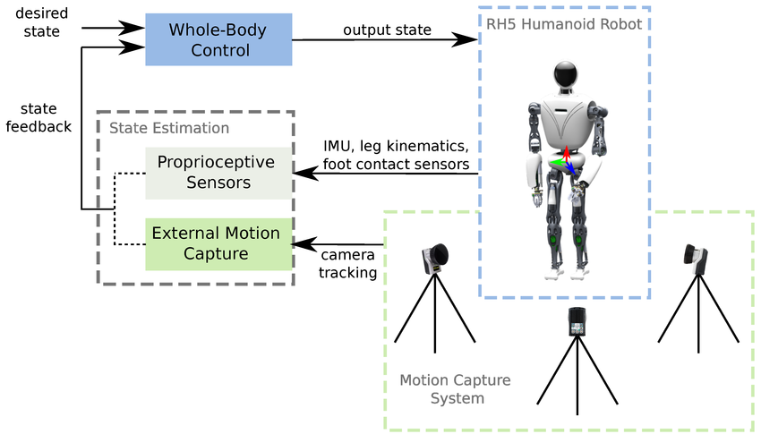

## جائزہ

یہ باب ہیومنائیڈ روبوٹس کو کنٹرول کرنے اور ان پر AI ماڈلز کی تعیناتی کے عملی پہلوؤں پر توجہ مرکوز کرتا ہے۔

## مقاصد

- ہیومنائڈ کنٹرول کے چیلنجوں کو سمجھیں۔
- کنٹرول کی مختلف حکمت عملیوں کے بارے میں جانیں۔
- AI ماڈلز کو فزیکل ہارڈ ویئر میں تعینات کرنے کے عمل کو دریافت کریں۔

## بنیادی مواد

ہیومنائیڈ روبوٹ کو کنٹرول کرنا ایک پیچیدہ کام ہے جس میں مستحکم لوکوموشن اور ہیرا پھیری کو حاصل کرنے کے لیے بہت سے جوڑوں کو مربوط کرنا شامل ہے۔ یہ اکثر پورے جسم کے کنٹرول کے فریم ورک کا استعمال کرتے ہوئے کیا جاتا ہے، جو توازن اور مشترکہ حدود جیسی رکاوٹوں کو مطمئن کرتے ہوئے مطلوبہ حرکت حاصل کرنے کے لیے درکار ہر جوڑ کے لیے ٹارک کی گنتی کرتا ہے۔

### تعیناتی کے تحفظات

جسمانی روبوٹ میں AI ماڈل کی تعیناتی کے لیے کئی غور و فکر کی ضرورت ہوتی ہے:

- **ریئل ٹائم پرفارمنس**: ماڈل کو ریئل ٹائم میں روبوٹ کو کنٹرول کرنے کے لیے کافی تیزی سے چلانے کے قابل ہونا چاہیے۔ اس کے لیے اکثر روبوٹ کے آن بورڈ کمپیوٹر کے لیے ماڈل کو بہتر بنانے کی ضرورت ہوتی ہے۔
- **حفاظت**: روبوٹ کو اپنے ماحول میں، خاص طور پر انسانوں کے ارد گرد محفوظ طریقے سے کام کرنا چاہیے۔ اس کے لیے حفاظتی اقدامات کو نافذ کرنے کی ضرورت ہے جیسے کہ ایمرجنسی اسٹاپ اور تصادم سے بچنا۔
- **مضبوطی**: ماڈل کو سینسر شور، ایکچیویٹر کی غلطیوں، اور ماحول سے غیر متوقع خلل کے لیے مضبوط ہونا چاہیے۔

## مثالیں۔

### تصوراتی پورے جسم کا کنٹرول

`` ازگر
numpy کو بطور np درآمد کریں۔
whole_body_controller سے WholeBodyController درآمد کریں۔

# پورے جسم کا کنٹرولر بنائیں
wbc = ہول باڈی کنٹرولر (روبوٹ_ماڈل)

# ایک کام کی وضاحت کریں، جیسے، ہاتھ کو ہدف کی پوزیشن پر لے جائیں۔
hand_target = np.array([0.5, 0.2, 1.0])
wbc.set_task("ہاتھ"، "پوزیشن"، ہینڈ_ٹارگٹ)

# مطلوبہ مشترکہ ٹارک کی گنتی کریں۔
joint_torques = wbc.compute_torques()

# روبوٹ کو ٹارک بھیجیں۔
robot.apply_torques(joint_torques)
``

## اعداد و شمار

*شکل 1: ہیومنائیڈ روبوٹ کے لیے پورے جسم کے کنٹرول کے فن تعمیر کا ایک آسان خاکہ۔*

## خلاصہ

اس باب میں ہیومنائیڈ کنٹرول کے چیلنجز اور AI ماڈلز کو فزیکل ہارڈویئر میں تعینات کرنے کے لیے عملی تحفظات پر تبادلہ خیال کیا گیا۔ ہم نے پورے جسم کے کنٹرولر کی ایک تصوراتی مثال دیکھی، جو پیچیدہ انسانی روبوٹ کو کنٹرول کرنے کا ایک عام طریقہ ہے۔ یہ فزیکل AI اور ہیومنائیڈ روبوٹکس کی دلچسپ دنیا سے ہمارے تعارف کا اختتام کرتا ہے۔